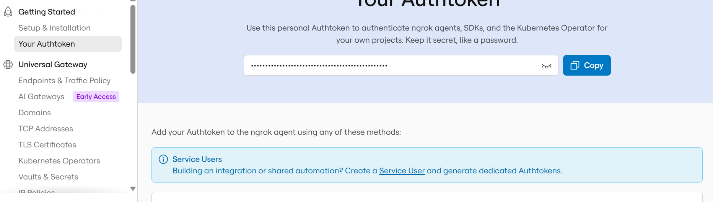
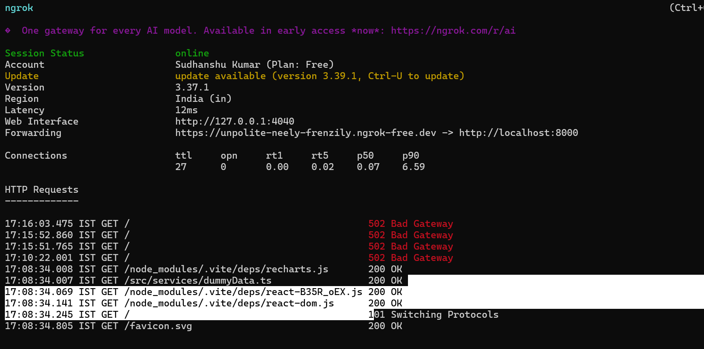

## Config for ngrok

To run ngrok, use the following steps

## Installation

- Install ngrok for your machine
- Login to the platform to get the key



[Installation](https://dashboard.ngrok.com/get-started/setup/windows)


## Run your app locally

```
npm run dev 
````
## Connect your ngrok agent with your auth token (OSX / Linux):

```
ngrok config add-authtoken [ENCRYPTION_KEY]
```

## Run ngrok
- Use PORT on which your server is running e.g 8000
```
ngrok http 8000
```

## URL is provided by ngrok when you run your server




- To know more visit [Getting started](https://ngrok.com/docs/getting-started)


